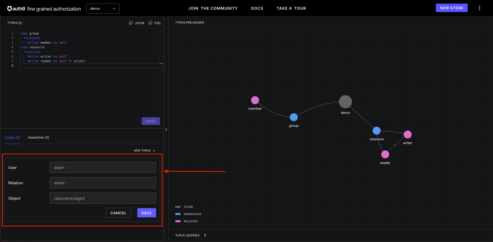
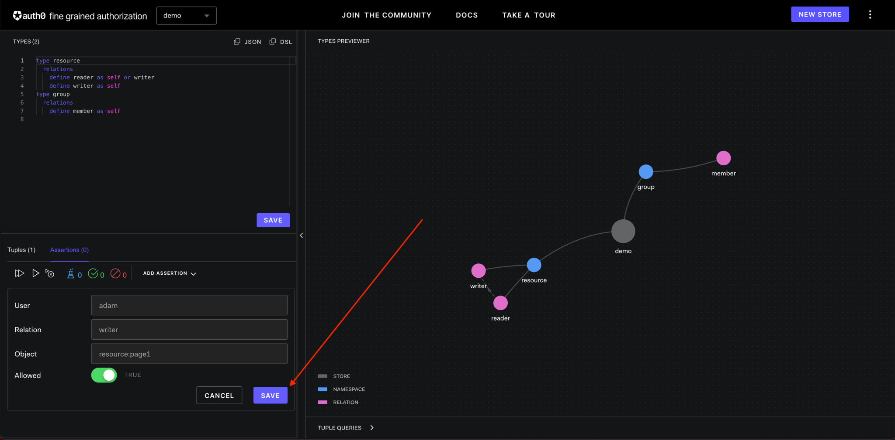
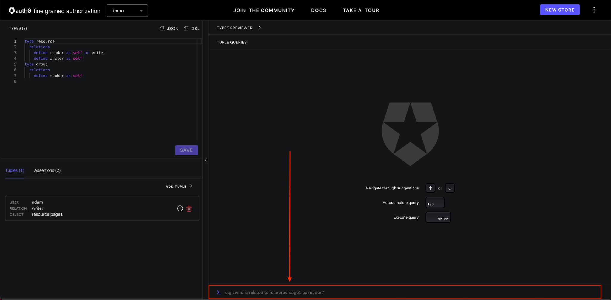
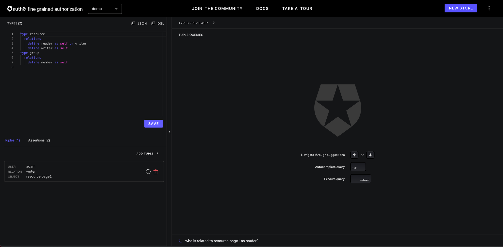

import {
  Banner,
  DocumentationNotice,
  ProductConcept,
  ProductName,
  ProductNameFormat,
  RelatedSection,
} from '@components/Docs';

# Introduction to the Auth0 Fine Grained Authorization (FGA) Playground

<DocumentationNotice />

## What is Auth0 FGA Playground?

The [Auth0 FGA Playground](https://play.fga.dev/) is a learning tool meant to help you learn and play with <ProductName format={ProductNameFormat.LongForm}/>. It allows you to easily create, visualize, share and test your authorization models.

:::caution Warning
Currently on the Playground, store security is through obscurity; to access a store you need to know its UUID, but there are no other checks. Please use identifiers and do not store any PII or data that cannot be public.
:::

<Banner
  title="The Auth0 FGA Playground"
  preset="playground"
  description="Get started with Auth0 Fine Grained Authorization on the Auth0 FGA Playground"
  link="https://play.fga.dev/"
/>

### Tour of Auth0 FGA Playground

If this is the first time you visit the Auth0 FGA Playground, it will ask you to go through a tour to explain how you can use it. We suggest taking a moment to complete the tour there before coming back to this post.

1. In your browser, open [https://play.fga.dev](https://play.fga.dev/) in a new tab.

2. You should see this page if this is the first time you click on that link:
   

   <figcaption>

   The [Auth0 FGA Playground](https://play.fga.dev) asking to complete the tutorial. Press **NEXT** to see the intro or **SKIP** to skip it

   </figcaption>

3. If you skip or complete the intro, you will be asked if you would like to go through the tour:
   

   <figcaption>

   The [Auth0 FGA Playground](https://play.fga.dev) asking to complete the tour. Press **TAKE A TOUR** to start the tour or **GET STARTED** to skip directly to the playground

   </figcaption>

4. You should see this page if you have completed the tour
   

   <figcaption>

   The [Auth0 FGA Playground](https://play.fga.dev) once the tour is completed

   </figcaption>

### Default Stores vs. User Stores

The Auth0 FGA Playground has both **default stores** and **user stores**.

**Default stores** have authorization models, relationship tuples and assertions that are pre-populated by Auth0 and are not modifiable. They are samples to allow you to better understand advanced use cases.

**User stores** are user defined configurations. The authorization models, relationship tuples and assertions may be modified and saved.

## Creating a new store

1. Click the **NEW STORE** button on the top right hand corner of the screen.
   

2. Type in store name in the text box. Note that the store name may only contain letters, numbers and '-'.
   

3. Click the **CREATE** button.
   

## Saving your model

1. On your **User Stores**, you may make changes to the <ProductConcept section="what-is-an-authorization-model" linkName="authorization model" /> in the types panel located on the upper left part of the screen. Note that only the [DSL syntax](../modeling/configuration-language.mdx#where-is-it-used-and-what-is-it-used-for) is supported.
   

2. After the changes are made, click **SAVE**.
   

3. After the authorization model is saved, the _Types Previewer_ will be updated with the new authorization model preview.
   

4. After the authorization model is saved, the **SAVE** button is no longer active.
   

   :::info

   - Playground will only save if there are no syntax errors.
   :::

   :::info
   Syntax errors will be highlighted in red. Hovering the mouse over the error will provide additional details.
   
   :::

## Adding relationship tuples

1. On your **User Stores**, you may add <ProductConcept section="what-is-a-relationship-tuple" linkName="relationship tuples" /> in the relationship tuples panel located on the lower left part of the screen.
   

2. Click the **ADD TUPLE** button to add new relationship tuples.
   

3. This will bring up the text boxes for User, Relation and Object. Type in the desired values.
   

4. Click the **SAVE** button.
   

5. The added relationship tuples will be shown in the relationship tuples panel.
   

6. Relationship tuples may be removed by clicking the garbage bin button.
   

   :::info
   Relationship tuples may not be added if the corresponding authentication model has not yet been saved/updated. This can be verified by having an _active_ **SAVE** button in the types panel.
   :::

## Adding assertions

1. On your **User Stores**, you may run assertions to test authorization models and relationship tuples. To add new assertions, click the _Assertions_ tab in the relationship tuples panel located on the lower left part of the screen.
   

2. After Assertions tab is selected, click **ADD ASSERTION** to add new assertions.
   

3. This will bring up the text for User, Relation and Object. Type in the values desired. The **Allowed** selection is _TRUE_ if you want to assert the relationship exists. Otherwise, **Allowed** selection is _FALSE_ if you want to assert the relationship does not exist.
   

4. Click the **SAVE** button to add the assertion.
   

5. Assert for non-existing relationship by selected **Allowed** to be _FALSE_.
   

6. To run all tests, click the **Run all tests** button.
   

7. The assertion test results are indicated in the assertion panels. The _blue experiment box_ shows the number of tests. The _green check box_ indicates the number of passing assertions. The _red slash box_ indicates the number of failed assertions.
   

## Running queries

1. You may also run relationship tuple queries to view how the relationship is established between a user and an object. To do this, click the _TUPLE QUERIES_ tab in the previewer panel at the lower right half of the screen.
   

2. After _TUPLE QUERIES_ tab is clicked, you will be shown the _TUPLE QUERIES_ panel where you can type the query at the text box.
   

There are two types of queries that can be asked:

### Is x related to y as z?

The first type of query is of the form: "Is x related to y as z?". This form of query will provide visualization on why the relationship exists between user and object.

1. In the query box, type "Is adam related to resource:page1 as reader?" and hit _Enter_.
   

2. A successful query will show visualization on how the relationship is established in the **TUPLE QUERIES** panel.
   

3. An unsuccessful query will be denoted with a red box in the **TUPLE QUERIES** panel.
   

### Who is related to y as z?

The second type of query is of the form: "Who is related to y as z?". This form of query will provide visualization on who has a particular relationship with an object.

1. In the query box, type "who is to related to resource:page1 as reader?" and hit _Enter_.
   

2. A successful query will show visualization on all the users that have the relationship in the **TUPLE QUERIES** panel. As it can be seen, only adam has reader relationship with resource:page1.
   

## Getting store ID

The store ID is a value that uniquely identify the store. To obtain the store ID:

1. Click on the three dots button on the top-right of the screen.
   

2. Select **Copy Store ID** on the top-right of the screen.
   

3. The store ID has been copied to your clipboard.

## Sharing the store

You can also share the store to others by sending them the playground's store URL. To share the store:

1. Click on the three dots button on the top-right of the screen.
   

2. Select **Share** on the top-right of the screen.
   

3. The playground's store URL has been copied to your clipboard.

4. To load the playground's shared store, paste the URL in the address bar and press enter. You will be asked to **Create store**. Enter a name that you wish to uniquely identify this store.
   

## Related Sections

<RelatedSection
  description="Take a look at the following sections for examples that can be tried on Auth0 FGA Playground."
  relatedLinks={[
    {
      title: 'Entitlements',
      description: 'Modeling Entitlements for a System in {ProductName}.',
      link: '/modeling/advanced/patterns/entitlements',
    },
    {
      title: 'IoT',
      description: 'Modeling Fine Grained Authorization for an IoT Security Camera System with {ProductName}.',
      link: '/modeling/advanced/use-cases/iot',
    },
    {
      title: 'Slack',
      description: 'Modeling Authorization for Slack with {ProductName}.',
      link: '/modeling/advanced/use-cases/slack',
    },
  ]}
/>
