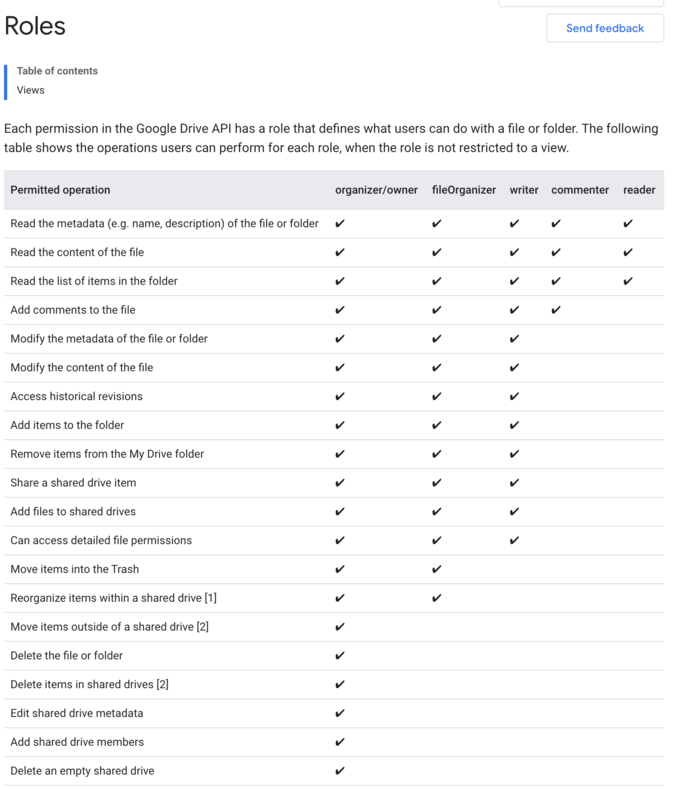

import {
  AuthzModelSnippetViewer,
  CardBox,
  CheckRequestViewer,
  DocumentationNotice,
  Playground,
  ProductConcept,
  ProductName,
  ProductNameFormat,
  RelatedSection,
  WriteRequestViewer,
} from '@components/Docs';

# Modeling Google Drive permissions with <ProductName format={ProductNameFormat.ShortForm}/>

<DocumentationNotice />

This tutorial explains how to represent [Google Drive](https://www.google.com/intl/en-GB/drive/) permissions model with <ProductName format={ProductNameFormat.ProductLink}/>.

<CardBox title="What you will learn">

- Indicate <ProductConcept section="what-is-a-relationship" linkName="relationships" /> between a group of **<ProductConcept section="what-is-a-user" linkName="users" />** and an **<ProductConcept section="what-is-an-object" linkName="object" />**. See [Modeling User Groups](../user-groups.mdx) for more. 
  Used here to indicate that all users within a domain can access a document (sharing a document within an organization).
- Model **concentric relationship** to have a certain <ProductConcept section="what-is-a-relation" linkName="relation" /> on an object imply another relation on the same object. See [Modeling Concepts: Concentric Relationships](../building-blocks/concentric-relationships.mdx) for more. 
  Used here is to indicate that writers are also commenters and viewers.
- Using [**the union operator**](../../modeling-language.mdx#the-union-operator) condition to indicate that a user might have a certain relation with an object if they match any of the criteria indicated. 
  Used here to indicate that a user can be a viewer on a document, or can have the viewer relationship implied through commenter.
- Using the **<ProductConcept section="what-is-type-bound-public-access" linkName="type bound public access" />** in a <ProductConcept section="what-is-a-relationship-tuple" linkName="relationship tuple's" /> user field to indicate that everyone has a certain relation with an object. See [Modeling Public Access](../public-access.mdx) for more. 
  Used here to [share documents publicly](#04-sharing-files-and-folders-publicly).
- Model [**parent-child objects**](../parent-child.mdx) to indicate that a user having a relationship with a certain object implies having a relationship with another object in <ProductName format={ProductNameFormat.ShortForm}/>. 
  Used here is to indicate that a writer on a folder is a writer on all documents inside that folder.

</CardBox>

<Playground title="Google Drive" preset="drive" example="Google Drive" store="gdrive" />

## Before You Start

In order to understand this guide correctly you must be familiar with some <ProductName format={ProductNameFormat.LongForm}/> concepts and know how to develop the things that we will list below.

### <ProductName format={ProductNameFormat.ShortForm}/> Concepts

It would be helpful to have an understanding of some concepts of <ProductName format={ProductNameFormat.ShortForm}/> before you start.

#### Modeling Concentric Relationships

You need to know how to update the authorization model to allow having nested relations such as all writers are readers. [Learn more →](../building-blocks/concentric-relationships.mdx)

#### Modeling Object-to-Object Relationships

You need to know how to create relationships between objects and how that might affect a user's relationships to those objects. [Learn more →](../building-blocks/object-to-object-relationships.mdx)

Used here to indicate that users who have access to view a folder have access to view all documents inside it.

#### Modeling Public Access

You need to know how to add a relationship tuple to indicate that a resource is publicly available. [Learn more →](../public-access.mdx)

#### Concepts & Modeling Language

- The <ProductConcept />
- [Modeling Language](../../modeling-language.mdx)

## What You Will Be Modeling

Google Drive is a system to store, share, and collaborate on files and folders. [Source](https://www.google.com/drive/)

In this tutorial, you will build a subset of the Google Drive permission model (detailed below) in <ProductName format={ProductNameFormat.LongForm}/>, using some scenarios to validate the model.

> Note: For brevity, this tutorial will not model all of Google Drive's permissions. Instead, it will focus on modeling for the scenarios outlined below

### Requirements

Google Drive's permission model is represented in [their documentation](https://developers.google.com/drive/api/v3/ref-roles).

In this tutorial, you will be focusing on a subset of these permissions.

Requirements:

- Users can be owners, editors, commenters and viewers of documents
- Documents can be shared with all users in a domain
- Folders can contain documents and users with a certain permission on a folder have that same permission to a document in that folder
- Documents and folders can be shared publicly

### Defined Scenarios

There will be the following users:

- Anne, who is in the xyz domain
- Beth, who is in the xyz domain
- Charles, who is in the xyz domain
- Diane, who is NOT in the xyz domain
- Erik, who is NOT in the xyz domain

There will be:

- a 2021-budget document, owned by Anne, shared for commenting with Beth and viewable by all members of the xyz domain.
- a 2021-planning folder, viewable by Diane and contains the 2021-budget document
- a 2021-public-roadmap document, owned by Anne, available for members xyz domain to comment on and is publicly viewable

## Modeling Google Drive's Permissions

### 01. Individual Permissions

To keep thing simple and focus on <ProductName format={ProductNameFormat.LongForm}/> features rather than Google Drive complexity we will model only four [roles](https://developers.google.com/drive/api/v3/ref-roles) (Viewer, Commenter, Writer, Owner).

At the end of this section we want to have the following permissions represented:

To represent permissions in <ProductName format={ProductNameFormat.ShortForm}/> we use <ProductConcept section="what-is-a-relation" linkName="relations" />. For document permissions we need to create the following <ProductConcept section="what-is-an-authorization-model" linkName="authorization model" />:

<AuthzModelSnippetViewer
  configuration={{
    schema_version: '1.1',
    type_definitions: [
      {
        type: 'user',
      },
      {
        type: 'document',
        relations: {
          owner: {
            this: {},
          },
          writer: {
            this: {},
          },
          commenter: {
            this: {},
          },
          viewer: {
            this: {},
          },
        },
        metadata: {
          relations: {
            owner: { directly_related_user_types: [{ type: 'user' }] },
            writer: { directly_related_user_types: [{ type: 'user' }] },
            commenter: { directly_related_user_types: [{ type: 'user' }] },
            viewer: { directly_related_user_types: [{ type: 'user' }] },
          },
        },
      },
    ],
  }}
/>

The <ProductName format={ProductNameFormat.LongForm}/> service determines if a <ProductConcept section="what-is-a-user" linkName="user" /> has access to an <ProductConcept section="what-is-an-object" linkName="object" /> by <ProductConcept section="what-is-a-check-request" linkName="checking" /> if the user has a relation to that object. Let us examine one of those relations in detail:

<AuthzModelSnippetViewer
  configuration={{
    schema_version: '1.1',
    type: 'document', // objects of type document
    relations: {
      // have users related to them as...
      viewer: {
        // "viewer": if those users belong to:
        this: {}, // the userset of all users related to the document as "viewer"
      },
    },
    metadata: {
      relations: {
        viewer: { directly_related_user_types: [{ type: 'user' }] },
      },
    },
  }}
  skipVersion={true}
/>

:::info

The snippet above indicates that objects of type document have users related to them as "viewer" if those users belong to the userset of all users related to the document as "viewer".

This means that a user can be <ProductConcept section="what-are-direct-and-implied-relationships" linkName="directly related" /> as a viewer to an object of type "document"

:::

If we want to say `beth` is a commenter of **document:2021-budget** we create this relationship tuple:

<WriteRequestViewer
  relationshipTuples={[
    {
      user: 'user:beth',
      relation: 'commenter',
      object: 'document:2021-budget',
    },
  ]}
/>

We can now ask <ProductName format={ProductNameFormat.ShortForm}/> "is `beth` a commenter of repository **document:2021-budget**?"

<CheckRequestViewer user={'user:beth'} relation={'commenter'} object={'document:2021-budget'} allowed={true} />

We could also say that `anne` is an owner of the same document:

<WriteRequestViewer
  relationshipTuples={[
    {
      user: 'user:anne',
      relation: 'owner',
      object: 'document:2021-budget',
    },
  ]}
/>

And <ProductConcept section="what-is-a-check-request" linkName="ask" /> some questions to <ProductName format={ProductNameFormat.ShortForm}/>:

<CheckRequestViewer user={'user:anne'} relation={'owner'} object={'document:2021-budget'} allowed={true} />
<CheckRequestViewer user={'user:anne'} relation={'writer'} object={'document:2021-budget'} allowed={false} />

The first reply makes sense but the second one does not. Intuitively, if `anne` was an **owner**, she was also be a **writer**. In fact, Google Drive explains this in [their documentation](https://developers.google.com/drive/api/v3/ref-roles)

To make <ProductName format={ProductNameFormat.ShortForm}/> aware of this "concentric" permission model we need to update our definitions:

<AuthzModelSnippetViewer
  configuration={{
    schema_version: '1.1',
    type_definitions: [
      {
        type: 'user',
      },
      {
        type: 'document', // objects of type document
        relations: {
          // have users related to them as
          owner: {
            this: {},
          },
          writer: {
            union: {
              child: [
                {
                  this: {},
                },
                {
                  computedUserset: {
                    relation: 'owner',
                  },
                },
              ],
            },
          },
          commenter: {
            union: {
              child: [
                {
                  this: {},
                },
                {
                  computedUserset: {
                    relation: 'writer',
                  },
                },
              ],
            },
          },
          viewer: {
            // "viewer": if they belong to
            union: {
              // any of (the union of) these user sets
              child: [
                {
                  this: {}, // the userset of all users related to the document as "viewer"
                },
                {
                  computedUserset: {
                    // the userset of all users related to the document as "commenter"
                    relation: 'commenter',
                  },
                },
              ],
            },
          },
        },
        metadata: {
          relations: {
            owner: { directly_related_user_types: [{ type: 'user' }] },
            writer: { directly_related_user_types: [{ type: 'user' }] },
            commenter: { directly_related_user_types: [{ type: 'user' }] },
            viewer: { directly_related_user_types: [{ type: 'user' }] },
          },
        },
      },
    ],
  }}
/>

:::info

Let's examine one of those relations in detail:

objects of type document have users related to them as "viewer": if they belong to any of (the union of) the following:

- the userset of all users related to the document as "viewer"
- the userset of all users related to the document as "commenter"

:::

With this update our model now supports nested definitions and now:

<CheckRequestViewer user={'user:anne'} relation={'owner'} object={'document:2021-budget'} allowed={true} />
<CheckRequestViewer user={'user:anne'} relation={'writer'} object={'document:2021-budget'} allowed={true} />

### 02. Organization Permissions

Google Drive allows you to share a file with everyone in your organization as a viewer, commenter or writer/editor.

At the end of this section we want to end up with the following permissions represented:

To add support for domains and members all we need to do is add this object to the <ProductName format={ProductNameFormat.ProductLink}/> <ProductConcept section="what-is-a-type-definition" linkName="authorization model" />. In addition, update the model to allow domain member to be assigned to document:

<AuthzModelSnippetViewer
  configuration={{
    schema_version: '1.1',
    type_definitions: [
      {
        type: 'user',
      },
      {
        type: 'document', // objects of type document
        relations: {
          // have users related to them as
          owner: {
            this: {},
          },
          writer: {
            union: {
              child: [
                {
                  this: {},
                },
                {
                  computedUserset: {
                    relation: 'owner',
                  },
                },
              ],
            },
          },
          commenter: {
            union: {
              child: [
                {
                  this: {},
                },
                {
                  computedUserset: {
                    relation: 'writer',
                  },
                },
              ],
            },
          },
          viewer: {
            // "viewer": if they belong to
            union: {
              // any of (the union of) these user sets
              child: [
                {
                  this: {}, // the userset of all users related to the document as "viewer"
                },
                {
                  computedUserset: {
                    // the userset of all users related to the document as "commenter"
                    relation: 'commenter',
                  },
                },
              ],
            },
          },
        },
        metadata: {
          relations: {
            owner: { directly_related_user_types: [{ type: 'user' }, { type: 'domain', relation: 'member' }] },
            writer: { directly_related_user_types: [{ type: 'user' }, { type: 'domain', relation: 'member' }] },
            commenter: { directly_related_user_types: [{ type: 'user' }, { type: 'domain', relation: 'member' }] },
            viewer: { directly_related_user_types: [{ type: 'user' }, { type: 'domain', relation: 'member' }] },
          },
        },
      },
      {
        type: 'domain',
        relations: {
          member: {
            this: {},
          },
        },
        metadata: {
          relations: {
            member: { directly_related_user_types: [{ type: 'user' }] },
          },
        },
      },
    ],
  }}
/>

:::info

Objects of type "domain" have users related to them as "member" if they belong to the userset of all users related to the domain as "member".

In other words, users can be direct members of a domain.

:::

Let's now create a domain, add members to it and make all members **viewers** of **document:2021-budget**.

<WriteRequestViewer
  relationshipTuples={[
    {
      _description: 'make anne, beth, charles a member of the xyz domain',
      user: 'user:anne',
      relation: 'member',
      object: 'domain:xyz',
    },
    {
      user: 'user:beth',
      relation: 'member',
      object: 'domain:xyz',
    },
    {
      user: 'user:charles',
      relation: 'member',
      object: 'domain:xyz',
    },
    {
      _description: 'make members of xyz domain viewers of document:2021-budget',
      user: 'domain:xyz#member',
      relation: 'viewer',
      object: 'document:2021-budget',
    },
  ]}
/>

The last relationship tuple introduces a new **<ProductName format={ProductNameFormat.ShortForm}/>** concept. A **<ProductConcept section="what-is-a-user" linkName="userset" />**. When the value of a user is formatted like this **objectType:objectId#relation**, <ProductName format={ProductNameFormat.LongForm}/> will automatically expand the userset into all its individual user identifiers:

<CheckRequestViewer user={'user:charles'} relation={'viewer'} object={'document:2021-budget'} allowed={true} />

### 03. Folder Permission Propagation

[Permission propagation](https://developers.google.com/drive/api/v3/manage-sharing#permission_propagation) happens between folders and files: if you are a viewer in a folder, you can view its documents. This applies even when you are not explicitly a viewer in a document.

At the end of this section we want to end up with the following permissions represented. Note that a folder is an object in the **document** type, as we do not need a separate type:

We need to add the notion that a **document** can be the **parent** of another **document**. We know how to do that:

<AuthzModelSnippetViewer
  configuration={{
    schema_version: '1.1',
    type_definitions: [
      {
        type: 'user',
      },
      {
        type: 'document',
        relations: {
          parent: {
            // add this relation
            this: {},
          },
          owner: {
            this: {},
          },
          writer: {
            union: {
              child: [
                {
                  this: {},
                },
                {
                  computedUserset: {
                    relation: 'owner',
                  },
                },
              ],
            },
          },
          commenter: {
            union: {
              child: [
                {
                  this: {},
                },
                {
                  computedUserset: {
                    relation: 'writer',
                  },
                },
              ],
            },
          },
          viewer: {
            union: {
              child: [
                {
                  this: {},
                },
                {
                  computedUserset: {
                    relation: 'commenter',
                  },
                },
              ],
            },
          },
        },
        metadata: {
          relations: {
            parent: { directly_related_user_types: [{ type: 'document' }] },
            owner: { directly_related_user_types: [{ type: 'user' }, { type: 'domain', relation: 'member' }] },
            writer: { directly_related_user_types: [{ type: 'user' }, { type: 'domain', relation: 'member' }] },
            commenter: { directly_related_user_types: [{ type: 'user' }, { type: 'domain', relation: 'member' }] },
            viewer: { directly_related_user_types: [{ type: 'user' }, { type: 'domain', relation: 'member' }] },
          },
        },
      },
    ],
  }}
/>

:::info

Notice the newly added "parent" relation in the configuration above.

:::

We can indicate this relation by adding the following relationship tuples

<WriteRequestViewer
  relationshipTuples={[
    {
      _description: 'Diane is a viewer of document:2021-planning',
      user: 'user:diane',
      relation: 'viewer',
      object: 'document:2021-planning',
    },
    {
      _description: 'document:2021-planning is a parent of document:2021-budget',
      user: 'document:2021-planning',
      relation: 'parent',
      object: 'document:2021-budget',
    },
  ]}
/>

What we still lack is the ability to propagate permissions from parent to children. We want to say that a user is a viewer of a document if either:

- [done] they have a viewer relationship (directly or through domain membership)
- [pending] they have a viewer relationship with the parent document

We need a way to consider the parent viewers, not just direct viewers of the document when getting a check for:

<CheckRequestViewer user={'user:diane'} relation={'viewer'} object={'document:2021-budget'} />

More details on this technique can be found in the section [Modeling Parent-Child Objects](../parent-child.mdx).

We express it like this:

<AuthzModelSnippetViewer
  configuration={{
    type: 'document',
    relations: {
      viewer: {
        union: {
          child: [
            {
              this: {},
            },
            {
              computedUserset: {
                relation: 'commenter',
              },
            },
            {
              tupleToUserset: {
                tupleset: {
                  // read all relationship tuples related to document:2021-budget as parent
                  // which returns [{ "object": "document:2021-budget", "relation": "parent", "user": "document:2021-planning"}]
                  relation: 'parent',
                },
                computedUserset: {
                  // and for each relationship tuple return all usersets that match the following, replacing $TUPLE_USERSET_OBJECT with document:2021-planning
                  // this will return relationship tuples of shape { "object": "document:2021-planning", "viewer", "user": ??? }
                  // including { "object": "document:2021-planning", "viewer", "user": "user:diane" }
                  relation: 'viewer',
                },
              },
            },
          ],
        },
      },
    },
    metadata: {
      relations: {
        viewer: { directly_related_user_types: [{ type: 'user' }, { type: 'domain', relation: 'member' }] },
      },
    },
  }}
  skipVersion={true}
/>

:::info

The users with a viewer relationship to a certain object of type "document" are any of:

- the "viewers": the set of users who are <ProductConcept section="what-are-direct-and-implied-relationships" linkName="directly related" /> to the document as a "viewer"
- the "commenters": the set of users who are related to the object as "commenter"
- the "viewers of the parents": from the objects who are related to the doc as parent, return the sets of users who are related to those objects as "viewer"

What the added section is doing is:

1. read all relationship tuples related to document:2021-budget as parent which returns:

`[{ "object": "document:2021-budget", "relation": "parent", "user": "document:2021-planning" }]`

2. for each relationship tuple read, return all usersets that match the following, returning tuples of shape:

`{ "object": "document:2021-planning", "viewer", "user": ??? }`

including: `{ "object": "document:2021-planning", "viewer", "user": "user:diane" }`

:::

The updated authorization model looks like this:

<AuthzModelSnippetViewer
  configuration={{
    schema_version: '1.1',
    type_definitions: [
      {
        type: 'user',
      },
      {
        type: 'document',
        relations: {
          owner: {
            union: {
              child: [
                {
                  this: {},
                },
                {
                  tupleToUserset: {
                    computedUserset: {
                      relation: 'owner',
                    },
                    tupleset: {
                      relation: 'parent',
                    },
                  },
                },
              ],
            },
          },
          writer: {
            union: {
              child: [
                {
                  this: {},
                },
                {
                  computedUserset: {
                    relation: 'owner',
                  },
                },
                {
                  tupleToUserset: {
                    computedUserset: {
                      relation: 'writer',
                    },
                    tupleset: {
                      relation: 'parent',
                    },
                  },
                },
              ],
            },
          },
          commenter: {
            union: {
              child: [
                {
                  this: {},
                },
                {
                  computedUserset: {
                    relation: 'writer',
                  },
                },
                {
                  tupleToUserset: {
                    computedUserset: {
                      relation: 'commenter',
                    },
                    tupleset: {
                      relation: 'parent',
                    },
                  },
                },
              ],
            },
          },
          viewer: {
            union: {
              child: [
                {
                  this: {},
                },
                {
                  computedUserset: {
                    relation: 'commenter',
                  },
                },
                {
                  tupleToUserset: {
                    computedUserset: {
                      relation: 'viewer',
                    },
                    tupleset: {
                      relation: 'parent',
                    },
                  },
                },
              ],
            },
          },
          parent: {
            this: {},
          },
        },
        metadata: {
          relations: {
            parent: { directly_related_user_types: [{ type: 'document' }] },
            owner: { directly_related_user_types: [{ type: 'user' }, { type: 'domain', relation: 'member' }] },
            writer: { directly_related_user_types: [{ type: 'user' }, { type: 'domain', relation: 'member' }] },
            commenter: { directly_related_user_types: [{ type: 'user' }, { type: 'domain', relation: 'member' }] },
            viewer: { directly_related_user_types: [{ type: 'user' }, { type: 'domain', relation: 'member' }] },
          },
        },
      },
      {
        type: 'domain',
        relations: {
          member: {
            this: {},
          },
        },
        metadata: {
          relations: {
            member: { directly_related_user_types: [{ type: 'user' }] },
          },
        },
      },
    ],
  }}
/>

### 04. Sharing Files And Folders Publicly

Google Drive has a feature which allows [sharing a file or folder publicly](https://support.google.com/a/users/answer/9308873?hl=en), and specifying the permissions a public user might have (writer/commenter/viewer).

Assume that `Anne` has created a new document: `2021-public-roadmap`, has shared it with commenter permissions to the `xyz.com`, and has shared it as view only with the public at large.

Here's where another <ProductName format={ProductNameFormat.LongForm}/> feature, <ProductConcept section="what-is-type-bound-public-access" linkName="type bound public access" /> (as in everyone), would come in handy.

First, we will need to update our model to allow for public access with type `user` for viewer relation.

<AuthzModelSnippetViewer
  configuration={{
    schema_version: '1.1',
    type_definitions: [
      {
        type: 'user',
      },
      {
        type: 'document',
        relations: {
          owner: {
            union: {
              child: [
                {
                  this: {},
                },
                {
                  tupleToUserset: {
                    computedUserset: {
                      relation: 'owner',
                    },
                    tupleset: {
                      relation: 'parent',
                    },
                  },
                },
              ],
            },
          },
          writer: {
            union: {
              child: [
                {
                  this: {},
                },
                {
                  computedUserset: {
                    relation: 'owner',
                  },
                },
                {
                  tupleToUserset: {
                    computedUserset: {
                      relation: 'writer',
                    },
                    tupleset: {
                      relation: 'parent',
                    },
                  },
                },
              ],
            },
          },
          commenter: {
            union: {
              child: [
                {
                  this: {},
                },
                {
                  computedUserset: {
                    relation: 'writer',
                  },
                },
                {
                  tupleToUserset: {
                    computedUserset: {
                      relation: 'commenter',
                    },
                    tupleset: {
                      relation: 'parent',
                    },
                  },
                },
              ],
            },
          },
          viewer: {
            union: {
              child: [
                {
                  this: {},
                },
                {
                  computedUserset: {
                    relation: 'commenter',
                  },
                },
                {
                  tupleToUserset: {
                    computedUserset: {
                      relation: 'viewer',
                    },
                    tupleset: {
                      relation: 'parent',
                    },
                  },
                },
              ],
            },
          },
          parent: {
            this: {},
          },
        },
        metadata: {
          relations: {
            parent: { directly_related_user_types: [{ type: 'document' }] },
            owner: { directly_related_user_types: [{ type: 'user' }, { type: 'domain', relation: 'member' }] },
            writer: { directly_related_user_types: [{ type: 'user' }, { type: 'domain', relation: 'member' }] },
            commenter: { directly_related_user_types: [{ type: 'user' }, { type: 'domain', relation: 'member' }] },
            viewer: {
              directly_related_user_types: [
                { type: 'user' },
                { type: 'user', wildcard: {} },
                { type: 'domain', relation: 'member' },
              ],
            },
          },
        },
      },
      {
        type: 'domain',
        relations: {
          member: {
            this: {},
          },
        },
        metadata: {
          relations: {
            member: { directly_related_user_types: [{ type: 'user' }] },
          },
        },
      },
    ],
  }}
/>

To mark Anne as the owner, the domain members as commenters and the public as viewers, we need to add the following relationship tuples:

<WriteRequestViewer
  relationshipTuples={[
    {
      _description: 'Anne is the owner of document:2021-public-roadmap',
      user: 'user:anne',
      relation: 'owner',
      object: 'document:2021-public-roadmap',
    },
    {
      _description: 'Members of the domain:xyz can comment on document:2021-public-roadmap',
      user: 'domain:xyz#member',
      relation: 'commenter',
      object: 'document:2021-public-roadmap',
    },
    {
      _description: 'Everyone with type `user` can view document:2021-public-roadmap',
      user: 'user:*',
      relation: 'viewer',
      object: 'document:2021-public-roadmap',
    },
  ]}
/>

Anne is an owner of the document

<CheckRequestViewer user={'user:anne'} relation={'owner'} object={'document:2021-public-roadmap'} allowed={true} />

Beth is a member of the xyz.com domain, and so can comment but cannot write

<CheckRequestViewer user={'user:beth'} relation={'writer'} object={'document:2021-public-roadmap'} allowed={false} />
<CheckRequestViewer user={'user:beth'} relation={'commenter'} object={'document:2021-public-roadmap'} allowed={true} />

Erik is NOT a member of the xyz.com domain, and so can only view the document

<CheckRequestViewer user={'user:erik'} relation={'writer'} object={'document:2021-public-roadmap'} allowed={false} />
<CheckRequestViewer user={'user:erik'} relation={'viewer'} object={'document:2021-public-roadmap'} allowed={false} />

<Playground title="Google Drive" preset="drive" example="Google Drive" store="gdrive" />

## Related Sections

<RelatedSection
  description="Take a look at the following sections for more information."
  relatedLinks={[
    {
      title: 'Search with permissions',
      description: 'Give your users search results with objects that they have access to',
      link: '../../interacting/search-with-permissions',
    },
  ]}
/>
