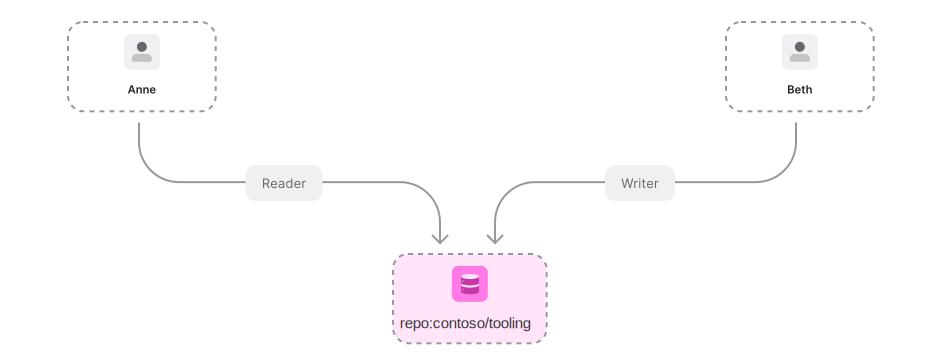
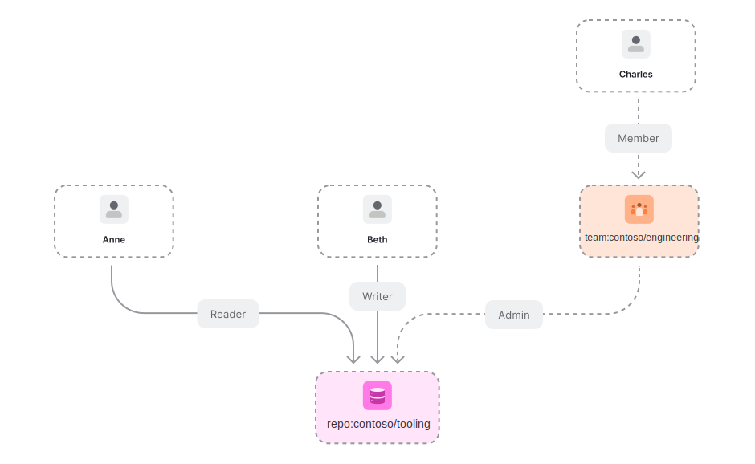
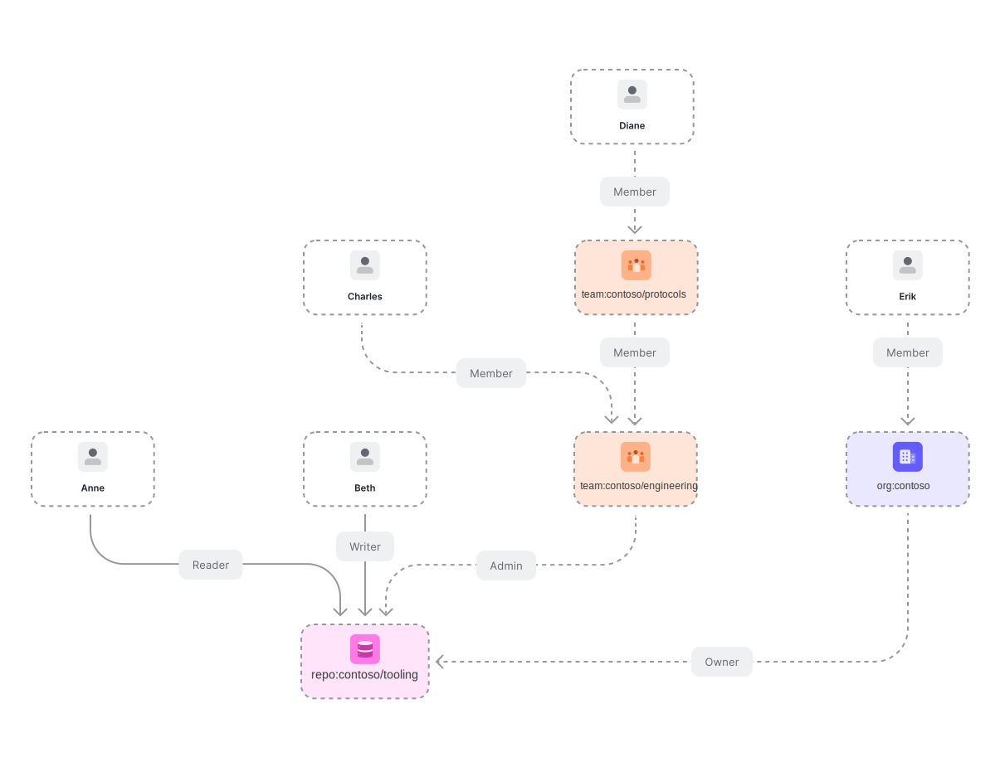

import {
  AuthzModelSnippetViewer,
  CardBox,
  CheckRequestViewer,
  DocumentationNotice,
  Playground,
  ProductConcept,
  ProductName,
  ProductNameFormat,
  WriteRequestViewer,
} from '@components/Docs';

# Modeling GitHub permissions with <ProductName format={ProductNameFormat.ShortForm}/>

<DocumentationNotice />

This tutorial explains how to model GitHub's Organization permission model using <ProductName format={ProductNameFormat.ProductLink}/>. [This article](https://docs.github.com/en/free-pro-team@latest/github/setting-up-and-managing-organizations-and-teams/managing-access-to-your-organizations-repositories) from the GitHub docs has links to all other articles we are going to be exploring in this document.

<CardBox title="What you will learn">

- Indicate <ProductConcept section="what-is-a-relationship" linkName="relationships" /> between a group of **<ProductConcept section="what-is-a-user" linkName="users" />** and an **<ProductConcept section="what-is-an-object" linkName="object" />**. See [Modeling User Groups](../user-groups.mdx) for more details. 
  Used here to indicate that all members of an organization are repository admins on the organization.
- Modeling **concentric relationship** to have a certain <ProductConcept section="what-is-a-relation" linkName="relation" /> on an object imply another relation on the same object. See [Modeling Concepts: Concentric Relationships](../building-blocks/concentric-relationships.mdx) for more. 
  Used here to indicate that maintainers of a repository are also writers of that repository.
- Using [**the union operator**](../../configuration-language.mdx#the-union-operator) condition to indicate that a user might have a certain relation with an object if they match any of the criteria indicated. 
  Used here to indicate that a user can be a reader on a repository, or can have the reader relationship implied through triager.
- Model [**parent-child objects**](../parent-child.mdx) to indicate that a user having a relationship with a certain object implies having a relationship with another object in <ProductName format={ProductNameFormat.ShortForm}/>. 
  Used here to indicate that a repository admin on a GitHub organization, is an admin on all repositories that organization owns.

</CardBox>

<Playground title="GitHub" preset="github" example="GitHub" store="github" />

## Before You Start

In order to understand this guide correctly you must be familiar with some <ProductName format={ProductNameFormat.LongForm}/> concepts and know how to develop the things that we will list below.

### <ProductName format={ProductNameFormat.ShortForm}/> Concepts

It would be helpful to have an understanding of some concepts of <ProductName format={ProductNameFormat.ShortForm}/> before you start.

#### Modeling Concentric Relationships

You need to know how to update the authorization model to allow having nested relations such as all writers are readers. [Learn more →](../building-blocks/concentric-relationships.mdx)

#### Modeling Object-to-Object Relationships

You need to know how to create relationships between objects and how that might affect a user's relationships to those objects. [Learn more →](../building-blocks/object-to-object-relationships.mdx)

Used here to indicate that users who have repo admin access on an organization, have admin access to all repositories owned by that organization.

#### Concepts & Configuration Language

- Some <ProductConcept />
- [Configuration Language](../../configuration-language.mdx)

## What You Will Be Modeling

GitHub is a system to develop and collaborate on code.

In this tutorial, you will build a subset of the GitHub permission model (detailed below) in <ProductName format={ProductNameFormat.LongForm}/>, using some scenarios to validate the model.

> Note: For brevity, this tutorial will not model all of GitHub's permissions. Instead, it will focus on modeling for the scenarios outlined below

### Requirements

GitHub's permission model is represented in [their documentation](https://docs.github.com/en/organizations/managing-access-to-your-organizations-repositories/repository-roles-for-an-organization#repository-roles-for-organizations).

In this tutorial, you will be focusing on a subset of these permissions.

Requirements:

- Users can be admins, maintainers, writers, triagers or readers of repositories (each level inherits all access of the level lower than it. e.g. admins inherit maintainer access and so forth)
- Teams can have members
- Organizations can have members
- Organizations can own repositories
- Users can have repository admin access on organizations, and thus have admin access to all repositories owned by that organization

### Defined Scenarios

There will be the following users:

- Anne
- Beth
- Charles, a member of the contoso/engineering team
- Diane, a member of the contoso/protocols team
- Erik, a member of the contoso org

And these requirements:

- members of the contoso/protocols team are members of the contoso/engineering team
- members of the contoso org are repo_admins on the org
- repo admins on the org are admins on all the repos the org owns

There will be a:

- contoso/tooling repository, owned by the contoso org and of which Beth is a writer and Anne is a reader and members of the contoso/engineering team are admins

## Modeling GitHub's Permissions

### 01. Permissions For Individuals In An Org

GitHub has [5 different permission levels for repositories](https://docs.github.com/en/free-pro-team@latest/github/setting-up-and-managing-organizations-and-teams/repository-permission-levels-for-an-organization):

At the end of this section we want to end up with the following permissions represented:

To represent permissions in <ProductName format={ProductNameFormat.LongForm}/> we use <ProductConcept section="what-is-a-relation" linkName="relations" />. For repository permissions we need to create the following <ProductConcept section="what-is-an-authorization-model" linkName="authorization model" />:

<AuthzModelSnippetViewer
  configuration={{
    schema_version: '1.1',
    type_definitions: [
      {
        type: 'user',
      },
      {
        type: 'repo',
        relations: {
          reader: {
            this: {},
          },
          triager: {
            this: {},
          },
          writer: {
            this: {},
          },
          maintainer: {
            this: {},
          },
          admin: {
            this: {},
          },
        },
        metadata: {
          relations: {
            reader: { directly_related_user_types: [{ type: 'user' }] },
            triager: { directly_related_user_types: [{ type: 'user' }] },
            writer: { directly_related_user_types: [{ type: 'user' }] },
            maintainer: { directly_related_user_types: [{ type: 'user' }] },
            admin: { directly_related_user_types: [{ type: 'user' }] },
          },
        },
      },
    ],
  }}
/>

The <ProductName format={ProductNameFormat.ShortForm}/> service determines if a <ProductConcept section="what-is-a-user" linkName="user" /> has access to an <ProductConcept section="what-is-an-object" linkName="object" /> by <ProductConcept section="what-is-a-check-request" linkName="checking" /> if the user has a relation to that object. Let us examine one of those relations in detail:

<AuthzModelSnippetViewer
  configuration={{
    schema_version: '1.1',
    type_definitions: [
      {
        type: 'user',
      },
      {
        type: 'repo', // objects of type "repo"
        relations: {
          // have users related to them as
          reader: {
            // "reader", if those users belong to
            this: {}, // the userset of all users related to the repo as "reader"
          },
        },
        metadata: {
          relations: {
            reader: { directly_related_user_types: [{ type: 'user' }] },
          },
        },
      },
    ],
  }}
/>

:::info

Objects of type "repo" have users related to them as "reader" if those users belong to the userset of all users related to the repo as "reader"

:::

If we want to say `anne` is a reader of repository **repo:contoso/tooling** we create this <ProductConcept section="what-is-a-relationship-tuple" linkName="relationship tuple" />:

<WriteRequestViewer
  relationshipTuples={[
    {
      user: 'user:anne',
      relation: 'reader',
      object: 'repo:contoso/tooling',
    },
  ]}
/>

We can now <ProductConcept section="what-is-a-check-request" linkName="ask" /> <ProductName format={ProductNameFormat.ShortForm}/> "is `anne` a reader of repository **repo:contoso/tooling**?"

<CheckRequestViewer user={'user:anne'} relation={'reader'} object={'repo:contoso/tooling'} allowed={true} />

We could also say that `beth` is a writer of the same repository:

<WriteRequestViewer
  relationshipTuples={[
    {
      user: 'user:beth',
      relation: 'writer',
      object: 'repo:contoso/tooling',
    },
  ]}
/>

And ask some questions to <ProductName format={ProductNameFormat.ShortForm}/>:

<CheckRequestViewer user={'user:beth'} relation={'writer'} object={'repo:contoso/tooling'} allowed={true} />
<CheckRequestViewer user={'user:beth'} relation={'reader'} object={'repo:contoso/tooling'} allowed={false} />

The first reply makes sense but the second one does not. Intuitively, if `beth` was writer, she was also be a reader. In fact, GitHub explains this in [their documentation](https://docs.github.com/en/free-pro-team@latest/github/setting-up-and-managing-organizations-and-teams/repository-permission-levels-for-an-organization#repository-access-for-each-permission-level)

To make <ProductName format={ProductNameFormat.ShortForm}/> aware of this "concentric" permission model we need to update our definitions:

<AuthzModelSnippetViewer
  configuration={{
    schema_version: '1.1',
    type_definitions: [
      {
        type: 'user',
      },
      {
        type: 'repo',
        relations: {
          reader: {
            union: {
              child: [
                {
                  this: {},
                },
                {
                  computedUserset: {
                    relation: 'triager',
                  },
                },
              ],
            },
          },
          triager: {
            union: {
              child: [
                {
                  this: {},
                },
                {
                  computedUserset: {
                    relation: 'writer',
                  },
                },
              ],
            },
          },
          writer: {
            union: {
              child: [
                {
                  this: {},
                },
                {
                  computedUserset: {
                    relation: 'maintainer',
                  },
                },
              ],
            },
          },
          maintainer: {
            union: {
              child: [
                {
                  this: {},
                },
                {
                  computedUserset: {
                    relation: 'admin',
                  },
                },
              ],
            },
          },
          admin: {
            this: {},
          },
        },
        metadata: {
          relations: {
            reader: { directly_related_user_types: [{ type: 'user' }] },
            triager: { directly_related_user_types: [{ type: 'user' }] },
            writer: { directly_related_user_types: [{ type: 'user' }] },
            maintainer: { directly_related_user_types: [{ type: 'user' }] },
            admin: { directly_related_user_types: [{ type: 'user' }] },
          },
        },
      },
    ],
  }}
/>

Let us examine one of those relations in detail:

<AuthzModelSnippetViewer
  configuration={{
    schema_version: '1.1',
    type: 'repo', // objects of type "repo"
    relations: {
      // have users related to them as
      reader: {
        // "reader": if they belong to
        union: {
          // any of (the union of) these user sets
          child: [
            {
              this: {}, // the userset of all users related to the repo as "reader"
            },
            {
              computedUserset: {
                // the userset of all users related to the repo as "triager"
                relation: 'triager',
              },
            },
          ],
        },
      },
    },
    metadata: {
      relations: {
        reader: { directly_related_user_types: [{ type: 'user' }] },
      },
    },
  }}
  skipVersion={true}
/>

:::info

The users with a reader relationship to a certain object of type "repo" are any of:

- the "readers": the set of users who are <ProductConcept section="what-are-direct-and-implied-relationships" linkName="directly related" /> to the repo as a "reader"
- the "triagers": the set of users who are related to the object as "triager"

:::

With this simple update our model now supports nested definitions and now:

<CheckRequestViewer user={'user:beth'} relation={'writer'} object={'repo:contoso/tooling'} allowed={true} />
<CheckRequestViewer user={'user:beth'} relation={'reader'} object={'repo:contoso/tooling'} allowed={true} />

### 02. Permissions For Teams In An Org

GitHub also supports [creating teams in an organization](https://docs.github.com/en/free-pro-team@latest/github/setting-up-and-managing-organizations-and-teams/creating-a-team), [adding members to a team](https://docs.github.com/en/free-pro-team@latest/github/setting-up-and-managing-organizations-and-teams/adding-organization-members-to-a-team) and [granting teams permissions, rather than individuals](https://docs.github.com/en/free-pro-team@latest/github/setting-up-and-managing-organizations-and-teams/managing-team-access-to-an-organization-repository).

At the end of this section we want to end up with the following permissions represented:

To add support for teams and memberships all we need to do is add this object to the <ProductName format={ProductNameFormat.ShortForm}/> <ProductConcept section="what-is-an-authorization-model" linkName="authorization model" />:

<AuthzModelSnippetViewer
  configuration={{
    schema_version: '1.1',
    type_definitions: [
      {
        type: 'team', // objects of type "team"
        relations: {
          // have users related to them as
          member: {
            // "member", if those users belong to
            this: {}, // the userset of all users related to the repo as "member"
          },
        },
        metadata: {
          relations: {
            member: { directly_related_user_types: [{ type: 'user' }, { type: 'team', relation: 'member' }] },
          },
        },
      },
    ],
  }}
/>

In addition, the repo's relations should have team member as a directly related user types.

<AuthzModelSnippetViewer
  configuration={{
    schema_version: '1.1',
    type_definitions: [
      {
        type: 'user',
      },
      {
        type: 'repo',
        relations: {
          reader: {
            union: {
              child: [
                {
                  this: {},
                },
                {
                  computedUserset: {
                    relation: 'triager',
                  },
                },
              ],
            },
          },
          triager: {
            union: {
              child: [
                {
                  this: {},
                },
                {
                  computedUserset: {
                    relation: 'writer',
                  },
                },
              ],
            },
          },
          writer: {
            union: {
              child: [
                {
                  this: {},
                },
                {
                  computedUserset: {
                    relation: 'maintainer',
                  },
                },
              ],
            },
          },
          maintainer: {
            union: {
              child: [
                {
                  this: {},
                },
                {
                  computedUserset: {
                    relation: 'admin',
                  },
                },
              ],
            },
          },
          admin: {
            this: {},
          },
        },
        metadata: {
          relations: {
            reader: { directly_related_user_types: [{ type: 'user' }, { type: 'team', relation: 'member' }] },
            triager: { directly_related_user_types: [{ type: 'user' }, { type: 'team', relation: 'member' }] },
            writer: { directly_related_user_types: [{ type: 'user' }, { type: 'team', relation: 'member' }] },
            maintainer: { directly_related_user_types: [{ type: 'user' }, { type: 'team', relation: 'member' }] },
            admin: { directly_related_user_types: [{ type: 'user' }, { type: 'team', relation: 'member' }] },
          },
        },
      },
    ],
  }}
/>

Let us now create a team, add a member to it and make it an admin of **repo:contoso/tooling** by adding the following <ProductConcept section="what-is-a-relationship-tuple" linkName="relationship tuples" />:

<WriteRequestViewer
  relationshipTuples={[
    {
      _description: 'make charles a member of the contoso/engineering team',
      user: 'user:charles',
      relation: 'member',
      object: 'team:contoso/engineering',
    },
    {
      _description: 'make members of contoso/engineering team admins of contoso/tooling',
      user: 'team:contoso/engineering#member',
      relation: 'admin',
      object: 'repo:contoso/tooling',
    },
  ]}
/>

The last relationship tuple introduces a new **<ProductName format={ProductNameFormat.ShortForm}/>** concept. A **<ProductConcept section="what-is-a-user" linkName="userset" />**. When the value of a user is formatted like this **type:objectId#relation**, <ProductName format={ProductNameFormat.ShortForm}/> will automatically expand the userset into all its individual user identifiers:

<CheckRequestViewer user={'user:charles'} relation={'admin'} object={'repo:contoso/tooling'} allowed={true} />

### 03. Permissions For Child Teams In An Org

GitHub also supports team nesting, [known as "child teams"](https://docs.github.com/en/free-pro-team@latest/github/setting-up-and-managing-organizations-and-teams/requesting-to-add-a-child-team). **Child teams inherit the access permissions of the parent team.**
Let's say we have a **protocols** team that is part of the **engineering**. The simplest way to achieve the aforementioned requirement is just adding this <ProductConcept section="what-is-a-relationship-tuple" linkName="relationship tuple" />:

<WriteRequestViewer
  relationshipTuples={[
    {
      user: 'team:contoso/protocols#member',
      relation: 'member',
      object: 'team:contoso/engineering',
    },
  ]}
/>

which says that members of protocols are members of engineering.

> **Note:** this is enough and valid for our current requirements, and for other read cases allows determining members of the direct team vs sub teams as the latter come from **team:contoso/protocols#member**. If the #member relation should not be followed for use cases a different approach could be taken.

We can now add a member to the protocols team and check that they are admins of the tooling repository.

<WriteRequestViewer
  relationshipTuples={[
    {
      _description: 'make diane a member of the contoso/protocols team',
      user: 'user:diane',
      relation: 'member',
      object: 'team:contoso/protocols',
    },
  ]}
/>

<CheckRequestViewer user={'user:diane'} relation={'admin'} object={'repo:contoso/tooling'} allowed={true} />

At the end of this section ended with the following permissions represented:

### 04. Base Permissions For Org Members

In GitHub, ["you can set base permissions that apply to all members of an organization when accessing any of the organization's repositories"](https://docs.github.com/en/free-pro-team@latest/github/setting-up-and-managing-organizations-and-teams/setting-base-permissions-for-an-organization). For our purposes this means that if:

- User `erik` is a member of an organization `contoso`
- _and_ `contoso` has a repository `tooling`
- _and_ `contoso` has configured base permission to be "write"

then `erik` has write permissions to tooling.

Let us model that!

At the end of this section we want to end up with the following permissions represented:

We need to introduce the notion of organization as a type, user organization membership and repository ownership as a relation. - It is worth calling that before this addition we were able to represent almost the entire GitHub repo permissions without adding the notion of organization to <ProductName format={ProductNameFormat.ShortForm}/>. Identifiers for users, repositories and teams were all that was necessary.
Let us add support for organizations and membership. Hopefully this feels familiar by now:

<AuthzModelSnippetViewer
  configuration={{
    schema_version: '1.1',
    type_definitions: [
      {
        type: 'organization', // objects of type "organization"
        relations: {
          // have users related to them as
          member: {
            // "member", if those users belong to
            this: {}, // the userset of all users related to the repo as "member"
          },
        },
        metadata: {
          relations: {
            member: { directly_related_user_types: [{ type: 'user' }] },
          },
        },
      },
    ],
  }}
/>

And support for repositories having owners:

<AuthzModelSnippetViewer
  configuration={{
    schema_version: '1.1',
    type_definitions: [
      {
        type: 'repo',
        relations: {
          reader: {
            union: {
              child: [
                {
                  this: {},
                },
                {
                  computedUserset: {
                    relation: 'triager',
                  },
                },
              ],
            },
          },
          triager: {
            union: {
              child: [
                {
                  this: {},
                },
                {
                  computedUserset: {
                    relation: 'writer',
                  },
                },
              ],
            },
          },
          writer: {
            union: {
              child: [
                {
                  this: {},
                },
                {
                  computedUserset: {
                    relation: 'maintainer',
                  },
                },
              ],
            },
          },
          maintainer: {
            union: {
              child: [
                {
                  this: {},
                },
                {
                  computedUserset: {
                    relation: 'admin',
                  },
                },
              ],
            },
          },
          admin: {
            this: {},
          },
          owner: {
            // An organization can "own" a repository
            this: {},
          },
        },
        metadata: {
          relations: {
            reader: {
              directly_related_user_types: [{ type: 'user' }, { type: 'team', relation: 'member' }],
            },
            triager: {
              directly_related_user_types: [{ type: 'user' }, { type: 'team', relation: 'member' }],
            },
            writer: {
              directly_related_user_types: [{ type: 'user' }, { type: 'team', relation: 'member' }],
            },
            maintainer: {
              directly_related_user_types: [{ type: 'user' }, { type: 'team', relation: 'member' }],
            },
            admin: {
              directly_related_user_types: [{ type: 'user' }, { type: 'team', relation: 'member' }],
            },
            owner: {
              directly_related_user_types: [{ type: 'organization' }],
            },
          },
        },
      },
    ],
  }}
/>

:::info

Note the added "owner" relation, indicating that organizations can own repositories.

:::

We can now make Erik a member of contoso and make contoso own **contoso/tooling**:

<WriteRequestViewer
  relationshipTuples={[
    {
      user: 'user:erik',
      relation: 'member',
      object: 'organization:contoso',
    },
    {
      user: 'organization:contoso',
      relation: 'owner',
      object: 'repo:contoso/tooling',
    },
  ]}
/>

What we still lack is the ability to create "default permissions" for the organization and have those be considered when determining if a user has a particular relation to a repository. Let's start with the simplest case **admin**. We want to say that a user is an admin of a repo if either:

- [done] they have a repo admin relation (directly or through team membership)
- [pending] their organization is configured with **repo_admin** as the base permission

We need a way to consider the organization members, not just direct relations to the repo when getting a check for:

<CheckRequestViewer user={'user:erik'} relation={'admin'} object={'repo:contoso/tooling'} />

More details on this technique can be found in the section [Modeling Parent-Child Objects](../parent-child.mdx).

We express it like this:

<AuthzModelSnippetViewer
  configuration={{
    schema_version: '1.1',
    type_definitions: [
      {
        type: 'repo',
        relations: {
          admin: {
            union: {
              child: [
                {
                  this: {},
                },
                {
                  tupleToUserset: {
                    // read all tuples related to tooling as owner
                    // which returns [{ "user": "organization:contoso", "relation": "owner", "object": "repo:contoso/tooling" }]
                    tupleset: {
                      relation: 'owner',
                    },
                    // and for each tuple return all usersets that match the following, replacing $TUPLE_USERSET_OBJECT with organization:contoso
                    // this will return tuples of shape { object: "organization:contoso", "repo_admin", "user": ??? }
                    computedUserset: {
                      relation: 'repo_admin',
                    },
                  },
                },
              ],
            },
          },
        },
        metadata: {
          relations: {
            admin: {
              directly_related_user_types: [
                { type: 'user' },
                { type: 'team', relation: 'member' },
                { type: 'organization', relation: 'member' },
              ],
            },
          },
        },
      },
    ],
  }}
  skipVersion={true}
/>

:::info

The users with an admin relationship to a certain object of type "repo" are any of:

- the "admins": the set of users who are <ProductConcept section="what-are-direct-and-implied-relationships" linkName="directly related" /> to the repo as an "admin"
- the "repository admins of the org that owns the repo": from the objects who are related to the doc as owner, return the sets of users who are related to those objects as "repo_admin"

What the added section is doing is:

1. read all relationship tuples related to repo:contoso/tooling as owner which returns:

`[{ "object": "repo:contoso/tooling", "relation": "owner", "user": "organization:contoso" }]`

2. for each relationship tuple read, return all usersets that match the following, returning tuples of shape:

`{ "object": "organization:contoso", "relation": "repo_admin", "user": ??? }`

:::

What should the **users** in those relationship tuples with **???** be?

- Well:
  - If the base permission for org contoso is repo_admin then it should be **organization:contoso#member**.
  - If the base permission for org contoso is NOT repo_admin, then it should be empty (no relationship tuple).
- Whenever the value of this dropdown changes:
  
  - Delete the previous relationship tuple and create a new one:
    <WriteRequestViewer
      relationshipTuples={[
        {
          user: 'organization:contoso#member',
          relation: 'repo_admin',
          object: 'organization:contoso',
        },
      ]}
    />

The updated authorization model looks like this:

<AuthzModelSnippetViewer
  configuration={{
    schema_version: '1.1',
    type_definitions: [
      {
        type: 'user',
      },
      {
        type: 'repo',
        relations: {
          admin: {
            union: {
              child: [
                {
                  this: {},
                },
                {
                  tupleToUserset: {
                    computedUserset: {
                      relation: 'repo_admin',
                    },
                    tupleset: {
                      relation: 'owner',
                    },
                  },
                },
              ],
            },
          },
          maintainer: {
            union: {
              child: [
                {
                  this: {},
                },
                {
                  computedUserset: {
                    relation: 'admin',
                  },
                },
              ],
            },
          },
          writer: {
            union: {
              child: [
                {
                  this: {},
                },
                {
                  computedUserset: {
                    relation: 'maintainer',
                  },
                },
                {
                  tupleToUserset: {
                    computedUserset: {
                      relation: 'writer',
                    },
                    tupleset: {
                      relation: 'owner',
                    },
                  },
                },
              ],
            },
          },
          triager: {
            union: {
              child: [
                {
                  this: {},
                },
                {
                  computedUserset: {
                    relation: 'writer',
                  },
                },
              ],
            },
          },
          reader: {
            union: {
              child: [
                {
                  this: {},
                },
                {
                  computedUserset: {
                    relation: 'triager',
                  },
                },
                {
                  tupleToUserset: {
                    computedUserset: {
                      relation: 'reader',
                    },
                    tupleset: {
                      relation: 'owner',
                    },
                  },
                },
              ],
            },
          },
          owner: {
            this: {},
          },
        },
        metadata: {
          relations: {
            reader: {
              directly_related_user_types: [
                { type: 'user' },
                { type: 'team', relation: 'member' },
                { type: 'organization', relation: 'member' },
              ],
            },
            triager: {
              directly_related_user_types: [
                { type: 'user' },
                { type: 'team', relation: 'member' },
                { type: 'organization', relation: 'member' },
              ],
            },
            writer: {
              directly_related_user_types: [
                { type: 'user' },
                { type: 'team', relation: 'member' },
                { type: 'organization', relation: 'member' },
              ],
            },
            maintainer: {
              directly_related_user_types: [
                { type: 'user' },
                { type: 'team', relation: 'member' },
                { type: 'organization', relation: 'member' },
              ],
            },
            admin: {
              directly_related_user_types: [
                { type: 'user' },
                { type: 'team', relation: 'member' },
                { type: 'organization', relation: 'member' },
              ],
            },
            owner: {
              directly_related_user_types: [{ type: 'organization' }],
            },
          },
        },
      },
      {
        type: 'organization',
        relations: {
          owner: {
            this: {},
          },
          repo_admin: {
            this: {},
          },
        },
        metadata: {
          relations: {
            owner: {
              directly_related_user_types: [{ type: 'organization' }],
            },
            repo_admin: {
              directly_related_user_types: [
                { type: 'user' },
                { type: 'team', relation: 'member' },
                { type: 'organization', relation: 'member' },
              ],
            },
          },
        },
      },
    ],
  }}
/>

## Summary

GitHub has a number of other permissions. You have [organization billing managers, users that can manage specific apps, etc](https://docs.github.com/en/free-pro-team@latest/github/setting-up-and-managing-organizations-and-teams/permission-levels-for-an-organization). We might explore those in the future, but hopefully this blog post has shown you how you could represent those cases using <ProductName format={ProductNameFormat.LongForm}/>.

<Playground title="GitHub" preset="github" example="GitHub" store="github" />
