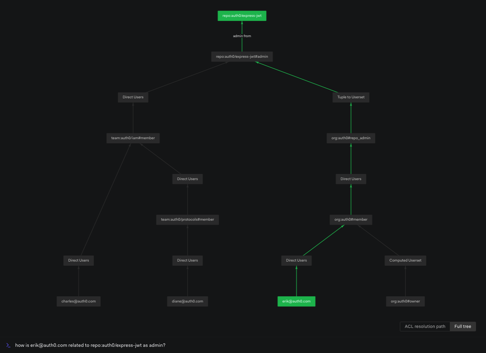

import { AuthzModelSnippetViewer } from '/snippets/AuthzModelSnippetViewer.jsx'
import { CheckRequestViewer } from '/snippets/CheckRequestViewer.jsx'

# Usersets

## What is a userset?

A userset represents a set or collection of users.

Usersets can be used to indicate that a group of users in the system have a certain relation with an object. This can be used to assign permissions to groups of users rather than specific ones, allowing us to represent the permissions in our system using less tuples and granting us flexibility in granting or denying access in bulk.

In OpenFGA, usersets are represented via this notation: `object#relation`, where object is made up of a type and an object identifier. For example:

- `company:xyz#employee` represents all users that are related to `company:xyz` as `employee`
- `tweet:12345#viewer` represents all users that are related to `tweet:12345` as `viewer`

## How do check requests work with usersets?

Imagine the following authorization model:

<AuthzModelSnippetViewer
  configuration={{
    schema_version: '1.1',
    type_definitions: [
      {
        type: 'user',
      },
      {
        type: 'org',
        relations: {
          member: {
            this: {},
          },
        },
        metadata: {
          relations: {
            member: { directly_related_user_types: [{ type: 'user' }] },
          },
        },
      },
      {
        type: 'document',
        relations: {
          reader: {
            this: {},
          },
        },
        metadata: {
          relations: {
            reader: { directly_related_user_types: [{ type: 'user' }, { type: 'org', relation: 'member' }] },
          },
        },
      },
    ],
  }}
/>

Now let us assume that the store has the following tuples:

```json
[
  {
    "user": "org:xyz#member",
    "relation": "reader",
    "object": "document:budget"
  },
  {
    "user": "user:anne",
    "relation": "member",
    "object": "org:xyz"
  }
]
```

If we call the check API to see if user `anne` has a `reader` relationship with `document:budget`, OpenFGA will check whether `anne` is part of the userset that does have a `reader` relationship. Because she is part of that userset, the request will return true:

<CheckRequestViewer user={'user:anne'} relation={'reader'} object={'document:budget'} allowed={true} />

## How do expand requests work with usersets?

Imagine the following authorization model:

<AuthzModelSnippetViewer
  configuration={{
    schema_version: '1.1',
    type_definitions: [
      {
        type: 'user',
      },
      {
        type: 'document',
        relations: {
          writer: {
            this: {},
          },
          reader: {
            union: {
              child: [
                {
                  this: {},
                },
                {
                  computedUserset: {
                    relation: 'writer',
                  },
                },
              ],
            },
          },
        },
        metadata: {
          relations: {
            reader: { directly_related_user_types: [{ type: 'user' }, { type: 'org', relation: 'member' }] },
            writer: { directly_related_user_types: [{ type: 'user' }, { type: 'org', relation: 'member' }] },
          },
        },
      },
    ],
  }}
/>

If we wanted to see which users and usersets have a `reader` relationship with `document:budget`, we can call the [Expand API](/api/service#Relationship%20Queries/Expand). The response will contain a userset tree where the leaf nodes are specific user IDs and usersets. For example:

```json
{
  "tree": {
    "root": {
      "type": "document:budget#reader",
      "union": {
        "nodes": [
          {
            "type": "document:budget#reader",
            "leaf": {
              "users": {
                "users": ["user:bob"]
              }
            }
          },
          {
            "type": "document:budget#reader",
            "leaf": {
              "computed": {
                "userset": "document:budget#writer"
              }
            }
          }
        ]
      }
    }
  }
}
```

As you can see from the response above, with usersets we can express [unions](/docs/configuration-language#the-union-operator) of user groups. We can also express [intersections](/docs/configuration-language#the-intersection-operator) and [exclusions](/docs/configuration-language#the-exclusion-operator).

## Internals

Using the type definitions in the authorization model, some of the situations we can represent are:

- that a user is **not** in a set of users having a certain relation to an object, even if a relationship tuple exists in the system. See [Disabling Direct Relationships](/docs/modeling/building-blocks/direct-relationships#2-with-direct-relationships-disabled)
- that a user has a certain relationship with an object if they are in the [union](/docs/configuration-language#the-union-operator), [intersection](/docs/configuration-language#the-intersection-operator) or [exclusion](/docs/configuration-language#the-exclusion-operator) of usersets.
- that a user being in a set of users having a certain relation to an object can result in them having another relation to the object. See [Concentric Relationships](/docs/modeling/building-blocks/concentric-relationships)
- that the user being in a set of users having a certain relation to an object and that object is in a set of users having a certain relation to another object, can imply that the original user has a certain relationship to the final object. See [Object-to-Object Relationships](/docs/modeling/building-blocks/object-to-object-relationships)

When executing the Check API of the form `check(user, relation, object)`, OpenFGA will perform the following steps:

1. In the authorization model, look up `type` and its `relation`. Start building a tree where the root node will be the definition of that `relation`, which can be a union, exclusion, or intersection of usersets, or it can be direct users.
1. Expand all the usersets involved into new nodes in the tree. This means recursively finding all the users that are members of the usersets. If there are direct relationships with users, create leaf nodes.
1. Check whether `user` is a leaf node in the tree. If the API finds one match, it will return immediately and will not expand the remaining nodes.



## Related Sections

<CardGroup>
  <Card title="Managing Group Membership" href="/docs/interacting/managing-group-membership">
    How to add users to a userset
  </Card>
  <Card title="Managing Group Access" href="/docs/interacting/managing-group-access">
    How to add permissions to a userset
  </Card>
</CardGroup>
